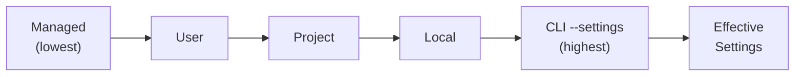

# Settings Layering

Caliban merges configuration from up to five sources before starting. Knowing the merge order lets you predict which value wins when the same key appears in multiple places.

## The five scopes

| Priority | Scope | Description |
|----------|-------|-------------|
| 1 (highest) | **CLI** | `--settings <FILE\|JSON>` overlay injected above local |
| 2 | **Local** | `.caliban/settings.local.toml` in the workspace |
| 3 | **Project** | `.caliban/settings.toml` in the workspace |
| 4 | **User** | OS user-config directory (see [File Locations](locations.md)) |
| 5 (lowest) | **Managed** | System-wide directory set by an operator |

Higher priority always wins for scalar values. The CLI scope is a virtual overlay — it has no on-disk file.



## Deep-merge semantics

Scalars use **highest-wins**: the value from the highest-priority scope that defines the key is used; lower scopes are ignored for that key.

Arrays and maps have richer rules:

| Key(s) | Merge behaviour |
|--------|----------------|
| `permissions.allow`, `.ask`, `.deny` | Concatenated in priority order (lower scopes first, higher appended); duplicates dropped |
| `permissions.rules` | Concatenated in priority order; source order within each scope is preserved |
| `hooks.<Event>` | Concatenated |
| `mcp_servers.<name>` | Deep-merged per server; a project scope can add an `env` key to a user-scope server without redefining the whole entry |
| `env` | Deep-merged (highest-priority value wins per key) |
| `additional_directories`, `claude_md_excludes` | Concatenated |
| Everything else | Highest-wins scalar |

## The `--settings` CLI overlay

`--settings` injects a virtual scope that sits above Local but below any active managed-block. It accepts either an inline JSON object or a path to a `.json` or `.toml` file:

```bash
# inline JSON
caliban --settings '{"model": "claude-opus-4-7"}'

# file path
caliban --settings /tmp/ci-overrides.toml
```

This is the recommended way to supply CI-specific settings without touching scope files.

## `parent_settings_behavior` — managed lockdown

When an operator sets `parent_settings_behavior = "block"` in the managed scope, the merge order flips: the managed scope moves to the **top** of the chain and overrides every other scope, including the CLI overlay.

```toml
# /Library/Application Support/Caliban/managed-settings.toml
parent_settings_behavior = "block"
model = "claude-haiku-4-7"
```

With `"block"` active, users cannot override `model` from their own settings or from `--settings`. The value `"augment"` is the default behaviour (managed sits at the bottom).

```admonish warning title="Enterprise lockdown"
When `parent_settings_behavior = "block"` is set in the managed scope, **all** user, project, local, and CLI settings for locked keys are ignored. The effective values come exclusively from the managed scope for those keys.
```

## `--setting-sources` — scope filtering

`--setting-sources` restricts which on-disk scopes are loaded. It accepts a comma-separated list of scope names: `managed`, `user`, `project`, `local`. The CLI overlay is always applied regardless of this flag.

```bash
# Load only user + project scopes (skip local overrides)
caliban --setting-sources user,project

# Pin to project scope only — useful for reproducible CI runs
caliban --setting-sources project
```

An unknown scope name is a fatal error (`exit 78`) rather than a silent no-op.

## Live reload

A file watcher monitors each scope's path with a 250 ms debounce. When a file changes, caliban re-loads and re-merges all scopes atomically and fires a `ConfigChange` hook event. Most keys take effect immediately:

- **Live-reloadable:** `permissions.*`, `hooks.*`, `api_key_helper.*`, `output_style`, `editor_mode`, `view_mode`, `statusLine`, `env`, `memory`, `additional_directories`, `claude_md_excludes`
- **Restart-required:** `model`, `fallback_model`, `mcp_servers.*`, `auto_compact_threshold`, `micro_compact_enabled`

Restart-required keys log a `WARN` on change and take effect on the next `caliban` invocation. The `/config` TUI overlay shows a "restart required" badge next to changed restart-required keys.

```admonish tip title="Inspecting the effective result"
Run `caliban config print` to see the fully-merged settings with per-key scope annotations, without starting a session.
```
