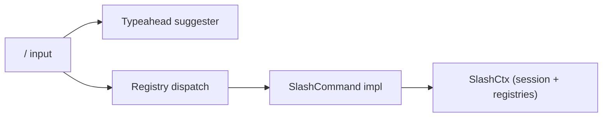

# Custom Slash Commands

Caliban's slash commands are managed through a central `SlashCommandRegistry`. Every command — whether built-in or plugin-supplied — registers in the same registry, which drives typeahead completion, the `/help` listing, and dispatch.

## The built-in registry (ADR 0040)

At startup, caliban registers approximately 30 built-in slash commands covering session management, context control, configuration, and diagnostics. The registry is the canonical source of truth for what commands exist; `/help` enumerates the live set.



Each command receives a `SlashCtx` containing the running session, provider, MCP manager, skills registry, hooks, and settings — everything it might need without requiring each command to thread individual dependencies through its call signature.

## Full built-in command list

See the [Slash Command Index](../reference/slash-index.md) for the authoritative list with descriptions and arguments.

Key commands relevant to the extending cluster:

| Command | Purpose |
|---|---|
| `/skills` | Show loaded skills and their descriptions |
| `/mcp` | Show MCP server status (connected / failed / disabled) |
| `/hooks` | Show active hook handlers |
| `/plugins` | List installed plugins with enable/disable status |
| `/config` | Interactive settings editor |
| `/output-style` | Pick an output style |

## Plugin-supplied commands

Plugins (ADR 0030) may register additional slash commands by placing command markdown files in their `commands/` subdirectory. The plugin system feeds these into the registry at startup using the same `SlashCommand` trait. Plugin-supplied commands are namespaced `<plugin>:<command>` so they cannot shadow built-ins by accident.

```admonish warning title="Custom user-defined slash commands are experimental"
The ability for end-users to drop custom slash command files into `.caliban/commands/` or `~/.config/caliban/commands/` (outside of a plugin) is **planned** but not yet wired. The `ComponentSpec.commands` field is reserved in the plugin manifest schema and the registry has the extension point, but standalone user-defined command files are not yet discovered at startup. Track progress against ADR 0040 and the parity matrix row M.

Until this lands, the recommended path for reusable operator-defined procedures is a [Skill](./skills.md), which supports the same markdown body format and is already fully discoverable.
```

## Hook on slash submission

`UserPromptSubmit` fires before the slash parser runs. The hook payload includes `is_slash: true`, `command`, and `args`. A hook can reject or rewrite a slash command — useful for audit logging or per-operator policy enforcement.

## Related pages

- [Slash Command Index](../reference/slash-index.md)
- [Skills](./skills.md)
- [Plugins](./plugins.md)
- [Hooks](./hooks.md)
