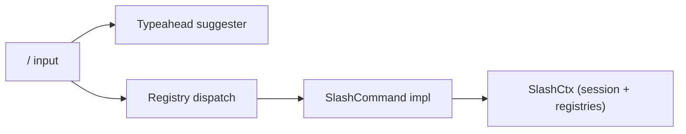

# Custom Slash Commands

Caliban's slash commands are managed through a central `SlashCommandRegistry`. Every command — whether built-in or plugin-supplied — registers in the same registry, which drives typeahead completion, the `/help` listing, and dispatch.

## The built-in registry (ADR 0040)

At startup, caliban registers roughly 40 built-in slash commands covering session management, context control, configuration, and diagnostics. The registry is the canonical source of truth for what commands exist; `/help` enumerates the live set.


```mermaid
flowchart LR
    Input["/ input"] --> Typeahead["Typeahead suggester"]
    Input --> Dispatch["Registry dispatch"]
    Dispatch --> Command["SlashCommand impl"]
    Command --> SlashCtx["SlashCtx (session + registries)"]
```

Each command receives a `SlashCtx` containing the running session, provider, MCP manager, skills registry, hooks, and settings — everything it might need without requiring each command to thread individual dependencies through its call signature.

## Full built-in command list

See the [Slash Command Index](../reference/slash-index.md) for the authoritative list with descriptions and arguments.

Key commands relevant to the extending cluster:

| Command | Purpose |
|---|---|
| `/skills` | Show loaded skills and their descriptions |
| `/mcp` | Show MCP server status (connected / failed / disabled) |
| `/hooks` | Show active hook handlers |
| `/plugins` | List installed plugins with enable/disable status |
| `/config` | Interactive settings editor |
| `/output-style` | Show the active output style and the available styles |

## Plugin-supplied commands

The plugin manifest (ADR 0030) accepts a `components.commands` entry, and the registry has an extension point for plugin commands. The plugin loader does not register them yet, so plugin-supplied slash commands are **not loaded today**. When they are, re-registering an existing name replaces it and logs a warning.

```admonish warning title="Custom user-defined slash commands are experimental"
The ability for end-users to drop custom slash command files into `.caliban/commands/` or `~/.config/caliban/commands/` (outside of a plugin) is **planned** but not yet wired. The `ComponentSpec.commands` field is reserved in the plugin manifest schema and the registry has the extension point, but standalone user-defined command files are not yet discovered at startup. Track progress against ADR 0040 and the parity matrix row M.

Until this lands, the recommended path for reusable operator-defined procedures is a [Skill](./skills.md), which supports the same markdown body format and is already fully discoverable.
```

## Hook on slash submission

`UserPromptSubmit` fires with the raw prompt text (including a leading `/command`). There are no dedicated slash-command fields in the payload. Only in-process hooks receive this event today; `command`/`http` handlers from config files cannot bind to it yet (see [Hooks](./hooks.md)).

## Related pages

- [Slash Command Index](../reference/slash-index.md)
- [Skills](./skills.md)
- [Plugins](./plugins.md)
- [Hooks](./hooks.md)
