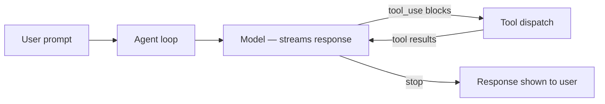

# What Is Caliban?

Caliban is an AI agent harness: a CLI that drives one or more language models through a
structured loop of prompts, tool calls, and responses while managing sessions, permissions,
memory, and extensibility around that loop. It is provider-agnostic — the same harness works
with Anthropic Claude (direct, Bedrock, Vertex), OpenAI (direct, Azure), Google Gemini (AI
Studio, Vertex), and local Ollama, all through a common internal representation.

## Capabilities at a glance

| Capability | What it gives you | Where to learn more |
|---|---|---|
| **Interactive TUI** | Full-screen terminal UI with transcript, status bar, slash-menu, file picker, and permission modals | [The Interactive TUI](../getting-started/tui.md) |
| **Headless / print mode** | One-shot `-p` flag for scripting; `stream-json` protocol for machine-readable output | [Headless Basics](../getting-started/headless.md) |
| **Persistent sessions** | Named sessions saved to disk; resume across invocations with `--resume` or `--continue` | [Sessions & Persistence](../interactive/sessions.md) |
| **Permissions** | Rule-based gate on every tool call; six modes from `default` to `bypassPermissions`; audit log | [Permissions Concepts](../permissions/concepts.md) |
| **Built-in tools** | Read, Write, Edit, MultiEdit, Glob, Grep, Bash, BashBg, WebFetch, WebSearch, NotebookEdit, TodoWrite, and more | [Built-in Tools](../tools/builtin.md) |
| **MCP client** | Connect external tool servers over stdio or HTTP; OAuth; per-server permission scoping | [MCP Servers](../extending/mcp.md) |
| **Sub-agents** | In-process agent calls, background agents via `caliband`, git-worktree isolation | [Sub-agents](../subagents/overview.md) |
| **Memory tiers** | Global, project, and auto-memory via `CLAUDE.md` ancestry and `@`-imports | [Memory Tiers](../memory/tiers.md) |
| **Model router** | Declarative routes per purpose (`MainLoop`, `Compaction`, …); fallback chains; circuit breakers | [The Model Router](../providers/router.md) |
| **Plugins, hooks & skills** | Bundle capabilities as plugins; hook lifecycle events; load skill files for slash commands | [Extending Caliban](../extending/skills.md) |

```admonish tip title="Provider-agnostic by design"
Because Caliban normalizes all providers to a single internal IR, you can switch models or
providers with a single flag (`--provider`, `--model`) or a `caliban.toml` router config,
without changing your workflow.
```

## The agent loop

At its core, Caliban runs a streaming agent loop:



Each turn streams from the model as it arrives; tool calls are dispatched as they appear and
their results fed back until the model produces a final text response. The loop runs
identically in TUI, headless, and library contexts.
