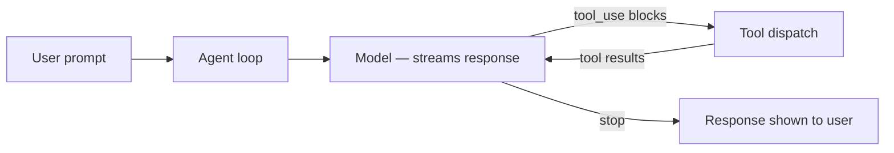

# What Is Caliban?

Caliban is an AI agent harness: a CLI that drives one or more language models through a
structured loop of prompts, tool calls, and responses while managing sessions, permissions,
memory, and extensibility around that loop. It is provider-agnostic — the same harness works
with Anthropic Claude, OpenAI, Google Gemini (AI Studio), and local OpenAI-compatible servers
(llama.cpp, mlx-lm), all through a common internal representation. (Bedrock, Vertex, and Azure
adapters exist as library crates but are not wired into the binary; see
[Supported Providers](../providers/overview.md).)

## Capabilities at a glance

| Capability | What it gives you | Where to learn more |
|---|---|---|
| **Interactive TUI** | Full-screen terminal UI with transcript, status bar, slash-menu, file picker, and permission modals | [The Interactive TUI](../getting-started/tui.md) |
| **Headless / print mode** | One-shot `-p` flag for scripting; `stream-json` protocol for machine-readable output | [Headless Basics](../getting-started/headless.md) |
| **Persistent sessions** | Named sessions saved to disk; resume across invocations with `--resume` or `--continue` | [Sessions & Persistence](../interactive/sessions.md) |
| **Permissions** | Rule-based gate on every tool call; six modes from `default` to `bypassPermissions`; audit log | [Permissions Concepts](../permissions/concepts.md) |
| **Built-in tools** | Read, Write, Edit, MultiEdit, Glob, Grep, Bash (+ BashOutput/KillShell), WebFetch, WebSearch, NotebookEdit, TodoWrite, and more | [Built-in Tools](../tools/builtin.md) |
| **MCP client** | Connect external tool servers over stdio or HTTP; OAuth; per-server permission scoping | [MCP Servers](../extending/mcp.md) |
| **Sub-agents** | In-process agent calls, background agents via `caliband`, git-worktree isolation | [Sub-agents](../subagents/overview.md) |
| **Memory tiers** | Global, project, and auto-memory via `CLAUDE.md` ancestry and `@`-imports | [Memory Tiers](../memory/tiers.md) |
| **Model router** | Declarative routes per purpose (`MainLoop`, `Compaction`, …); fallback chains; circuit breakers | [The Model Router](../providers/router.md) |
| **Plugins, hooks & skills** | Bundle capabilities as plugins; hook lifecycle events; load skill files for slash commands | [Extending Caliban](../extending/skills.md) |
| **Driveable server surfaces** | Steer a run from another program over an MCP server, ACP (editors), or plain HTTP | [Driving Caliban](../driving/overview.md) |

```admonish tip title="Provider-agnostic by design"
Because Caliban normalizes all providers to a single internal IR, you can switch models or
providers with a single flag (`--provider`, `--model`) or a `caliban.toml` router config,
without changing your workflow.
```

## The agent loop

At its core, Caliban runs a streaming agent loop:


```mermaid
flowchart LR
    U[User prompt] --> A[Agent loop]
    A --> M[Model — streams response]
    M -->|tool_use blocks| T[Tool dispatch]
    T -->|tool results| M
    M -->|stop| O[Response shown to user]
```

Each turn streams from the model as it arrives; tool calls are dispatched as they appear and
their results fed back until the model produces a final text response. The loop runs
identically in TUI, headless, and library contexts.

## The caliban-ai ecosystem

Caliban is the agent harness at the bottom of a small family of sibling projects. Each
one is a separate repository, and none of them is needed to use caliban on its own.

| Project | Role | Relationship to caliban |
|---|---|---|
| [prospero](https://github.com/caliban-ai/prospero) | Control plane for launching, managing, and observing fleets of agents across repositories | Sits above many `caliband` daemons and speaks their wire protocol. It does not depend on caliban crates. |
| [gonzalo](https://github.com/caliban-ai/gonzalo) | Shareable persistence layer and code graph | Caliban's optional `gonzalo` build feature routes sessions and auto-memory through the gonzalo facade. The `gonzalo-mcp` code-graph server plugs in as an ordinary [MCP server](../extending/mcp.md). |
| [caliban-operator](https://github.com/caliban-ai/caliban-operator) | Kubernetes operator (`Workspace` and `CalibanTask` CRDs) | Reconciles tasks into sandboxed pods that run `caliband` and caliban agents. |
| [ariel](https://github.com/caliban-ai/ariel) | Chat bridge for fleet notifications, commands, and approvals: Discord first, then Slack and Microsoft Teams | Works through prospero's HTTP API and keeps identity, channel config, and audit records in gonzalo. It reaches caliban only indirectly, through prospero. Ariel is in **early implementation**: a prospero client, a Discord backend, and an `arield` daemon exist, but the daemon does not yet connect the backend to prospero and gonzalo, so nothing works end to end. |
