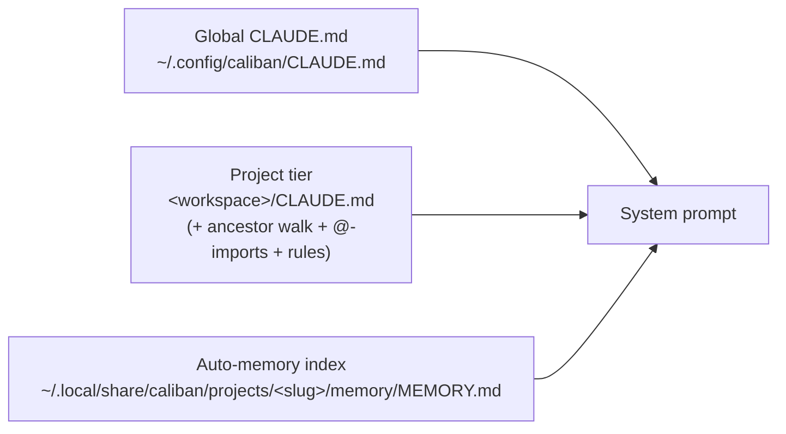

# Memory Tiers

Caliban carries three on-disk memory tiers that are spliced into every system
prompt before the session starts. All three are plain Markdown files you can
read and edit with any text editor. A fourth tier — MCP-mediated long-form
memory — is planned for a future release.



The splice order is always **global → project → auto-memory**, each tier
wrapped in an XML-tagged block so the model can distinguish them:

```text
<global-claude-md path="…/CLAUDE.md">
…
</global-claude-md>

<project-claude-md path="…/CLAUDE.md">
…
</project-claude-md>

<auto-memory-index path="…/MEMORY.md">
…
</auto-memory-index>

<default system prompt…>
```

Missing tiers are silently omitted — no empty tag block is emitted.

## Tier 1 — Global

**Path:** `~/.config/caliban/CLAUDE.md` (XDG `$XDG_CONFIG_HOME` honored)

Owned by the operator. Caliban never writes here. Use it for cross-project
preferences: tool choices, tone, coding style, personas. Read once at startup;
missing file is fine.

## Tier 2 — Project

**Path:** `<workspace_root>/CLAUDE.md` — plus the ancestor walk described in
[CLAUDE.md & Imports](claude-md.md).

Owned by the project / repository — commit it like any other file. Contains
repo-specific conventions, build commands, and taboos. Caliban never writes
here.

## Tier 3 — Auto-memory

**Directory:** `~/.local/share/caliban/projects/<sanitized-cwd>/memory/`
(XDG `$XDG_DATA_HOME` honored; override with `CALIBAN_AUTO_MEMORY_DIRECTORY`
or `CALIBAN_MEMORY_DIR`).

Owned by **the agent**. The agent uses `ReadMemoryTopic` and `WriteMemoryTopic`
— two built-in tools — to maintain a per-project knowledge base across
sessions. See [Auto-Memory](auto-memory.md) for the full format and write
protocol.

Only `MEMORY.md` (the index, capped at 200 lines / 25 KB) is loaded eagerly
each session. Topic files are read on demand.

## Token budget

The combined memory prefix defaults to **32 000 tokens** (estimated as
`bytes / 4`, provider-agnostic). If the combined size exceeds the cap,
the auto-memory tier is truncated first (a `[truncated: N bytes]` notice is
appended to its block), then the project tier, then the global tier.

Per-tier caps can be set in the `[memory]` block of `settings.toml`:

```toml
[memory]
cap_tokens_auto      = 8000   # cap the auto tier independently
cap_tokens_claude_md = 16000  # cap the combined CLAUDE.md tier
cap_tokens_combined  = 28000  # override the combined ceiling
```

The same values can be set via environment variables:
`CALIBAN_MEMORY_BUDGET_TOKENS`, `CALIBAN_MEMORY_CAP_TOKENS_AUTO`, and
`CALIBAN_MEMORY_CAP_TOKENS_CLAUDE_MD`.

When the sum of both per-tier caps would exceed the combined ceiling, each is
scaled down proportionally so the sum fits.

## The Memory tool and `/memory`

The built-in `Memory` tool is the agent-facing interface for reading and writing
the auto-memory tier. See [Built-in Tools](../tools/builtin.md) for the full
tool reference.

The `/memory` slash command shows the active tiers, their paths, and their
estimated token counts:

```text
/memory
  global   ~/.config/caliban/CLAUDE.md (412 tokens)
  project  /Users/me/dev/myproject/CLAUDE.md (880 tokens)
  auto     ~/.local/share/caliban/projects/…/memory/MEMORY.md (256 tokens)
    walk     /Users/me/dev/myproject/CLAUDE.md (880 tokens)
```

```admonish tip title="Disable auto-memory for CI"
Set `CALIBAN_DISABLE_AUTO_MEMORY=1` to drop the auto-memory tier entirely and
prevent the auto-memory skill from loading. This guarantees identical system
prompts across headless and CI runs regardless of on-disk memory state.
`--bare` sets the same flag automatically.
```
