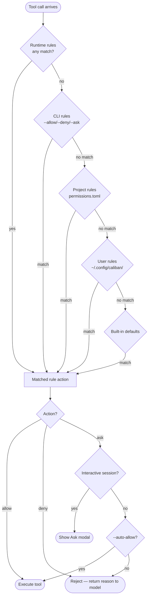

# Concepts

Every tool call the model makes — `Bash`, `Write`, `Edit`, a fetched URL, an MCP action — passes through the permission system before it executes. The system is a flat list of rules evaluated from top to bottom; the first rule that matches determines the outcome.

## Actions

Each rule maps a pattern to one of three actions:

| Action | Meaning |
|--------|---------|
| `allow` | Execute the tool call immediately, no prompt. |
| `deny` | Reject the tool call. An optional `reason` string is returned to the model so it can retry differently. |
| `ask` | Pause and ask the operator interactively. In headless mode without `--auto-allow`, `ask` degrades to a hard deny. |

## Rule structure

A rule is a TOML table with a `pattern` and an `action`, plus optional metadata:

```toml
[[permissions.rules]]
pattern  = "Bash:git *"       # required — see Pattern Grammar
action   = "allow"            # required — allow | deny | ask
comment  = "git ops are fine" # optional — shown in the Ask modal, not to the model
reason   = "…"                # optional, deny-only — returned to the model
expires_at = "2027-01-01T00:00:00Z"  # reserved, parsed but not yet enforced
```

## Evaluation order

Rules are evaluated **top-to-bottom; first match wins**.

Sources are merged in priority order before evaluation, so high-priority sources simply appear earlier in the flat list:

1. **CLI flags** (`--allow`, `--deny`, `--ask`) — highest priority; prepended at startup.
2. **Project file** — `<workspace>/.caliban/permissions.toml`.
3. **User file** — `$XDG_CONFIG_HOME/caliban/permissions.toml` (default: `~/.config/caliban/permissions.toml`).
4. **Built-in defaults** — lowest priority; appended automatically.

Within a single file, rules are ordered exactly as written. The `[[permissions.rules]]` array preserves authoring order, so narrow rules belong above broader ones.

```admonish tip title="Legacy three-bucket compat"
Older configs used a `permissions.{allow,ask,deny}` key per action rather than an ordered array. Caliban still loads that format on read and normalizes it into the ordered array, but all caliban-owned writes (the Ask modal, `/permissions`, `caliban perms add`) emit the canonical `[[permissions.rules]]` form. Convert your config with `caliban perms export --format toml`.
```

## Built-in defaults

When no rule matches a tool call before the end of the list, the built-in defaults serve as a safety net:

| Pattern | Default action |
|---------|---------------|
| `Read` | allow |
| `Grep` | allow |
| `Glob` | allow |
| `TodoWrite` | allow |
| `EnterPlanMode` | allow |
| `ExitPlanMode` | allow |
| `WebFetch` | ask |
| `Bash` | ask |
| `Write` | ask |
| `Edit` | ask |
| `*` (catch-all) | ask |

Unknown tools (MCP tools, future built-ins) fall through to the `*` catch-all and are `ask` by default.

## Decision flow



The **Permission Mode** wraps this pipeline and can override the `ask` verdict (but never a static `allow` or `deny`). See [Permission Modes](./modes.md) for details.
