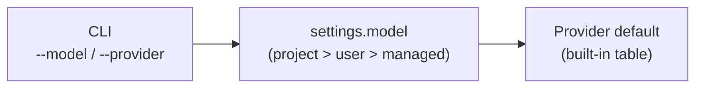

# Model Selection

Caliban lets you choose the exact model at the command line, in settings, or via the model router. When multiple sources specify a model, a clear precedence chain resolves the winner.

## Selecting a model at the command line

Use `--model` to name the model you want:

```bash
caliban --model claude-opus-4-7 "write a haiku"
caliban --provider openai --model gpt-5.5 "explain monads"
caliban --provider google --model gemini-2.0-flash "summarize this"
caliban --provider ollama --model qwen3.5:9b "local inference"
```

## Per-provider defaults

When `--model` is omitted and no model is set in settings, caliban uses a built-in default for the chosen provider:

| Provider | Default model |
|---|---|
| `anthropic` | `claude-sonnet-4-6` |
| `openai` | `gpt-5.5` |
| `google` | `gemini-2.0-flash` |
| `ollama` | `llama3.1` |

## Setting a model in settings

Set `model` in your project or user settings file to avoid repeating `--model` on every invocation. Two forms are accepted:

**Bare string** — the provider is inferred from the model name resolution or `--provider`:

```toml
model = "claude-sonnet-4-6"
```

**Qualified object** — explicitly names both the provider and the model:

```toml
[model]
provider = "anthropic"
name = "claude-sonnet-4-6"
```

The qualified form is the safest option in shared project configs because it makes the intended provider unambiguous.

You can also set a `fallback_model` that caliban uses when the primary model errors:

```toml
[model]
provider = "anthropic"
name = "claude-opus-4-7"

[fallback_model]
provider = "anthropic"
name = "claude-sonnet-4-6"
```

## Fallback model (`--fallback-model`)

Pass `--fallback-model` on the command line to override the settings fallback for a single run:

```bash
caliban --model claude-opus-4-7 --fallback-model claude-sonnet-4-6 "long task"
```

The fallback is wired through `caliban-model-router` (ADR 0038) and is also surfaced in the headless `system/init` frame.

## Per-turn limits

Control token usage and sampling with these flags:

| Flag | Default | Description |
|---|---|---|
| `--max-tokens N` | `2048` | Per-turn output token limit. Must be ≥ 1. |
| `--temperature F` | *(provider default)* | Sampling temperature in `[0.0, 2.0]`. Values outside this range are rejected at startup. |

```bash
caliban --max-tokens 8192 --temperature 0.2 "write a long essay"
```

## Per-purpose model overrides (`model_overrides`)

For finer-grained control without a full router config, set `model_overrides` in settings to pin specific request purposes to a particular model string:

```toml
[model_overrides]
fast-classifier = "claude-haiku-4-5"
summarization = "claude-haiku-4-5"
```

The keys must match the purpose slugs understood by the router (`main_loop`, `summarization`, `fast_classifier`, `sub_agent`, `embedding`). This setting does not support cross-provider routing; use the [model router](./router.md) for that.

## Precedence

When multiple sources specify a model, this chain resolves the winner (highest priority first):



1. **CLI flags** (`--model`, `--provider`) — always win.
2. **`settings.model`** — merged across the settings scope chain (project > user > managed).
3. **Provider built-in default** — the per-provider fallback in the table above.

For the most flexible per-purpose routing, see [The Model Router](./router.md).
