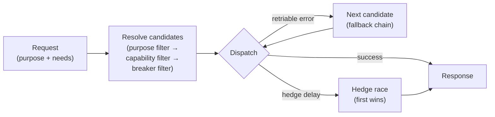

# The Model Router

```admonish note title="Advanced / optional feature"
The model router is an optional layer. If you only need a single provider and model, the `--provider` and `--model` flags are all you need. This chapter is relevant when you want per-purpose model dispatch, fallback chains, hedging, or circuit breakers.
```

The model router is a purpose-keyed dispatcher that sits between the agent loop and your provider adapters. It lets you assign different models — from the same or different providers — to different kinds of requests, and adds resilience features (fallback, hedging, circuit breakers) on top.

## Why a router?

The agent makes provider calls for several distinct purposes: the main conversational loop, summarization for compaction, fast classification for permission decisions, sub-agent loops, and more. The router lets you express policies like:

- Use Claude Opus for main-loop turns, Claude Haiku for summarization.
- Route fast classification to a local Ollama model (zero API cost, low latency).
- Fall back from Anthropic to OpenAI if Anthropic returns a rate-limit error.

## Request purposes

Each internal request carries a `purpose` that the router uses for dispatch:

| Purpose | Slug | Description |
|---|---|---|
| Main loop | `main_loop` | Primary conversational turns |
| Summarization | `summarization` | Context compaction summaries |
| Fast classifier | `fast_classifier` | Auto-mode permission decisions |
| Sub-agent | `sub_agent` | Spawned sub-agent loops |
| Embedding | `embedding` | Embedding / memory retrieval |
| Other | `other` | Requests that don't fit a category |

## Enabling the router

Drop a `caliban.toml` file in your project root. Caliban discovers it by walking up from the current directory to the nearest git root or `$HOME`, then falls back to `~/.config/caliban/caliban.toml`. You can also point directly to a file:

```bash
caliban --config /path/to/caliban.toml "my prompt"
# or via env var:
CALIBAN_ROUTER_CONFIG=/path/to/caliban.toml caliban "my prompt"
```

Discovery order (highest priority first): `--config` flag → `CALIBAN_ROUTER_CONFIG` → walk-up from current directory → `~/.config/caliban/caliban.toml`.

## Basic configuration

A minimal `caliban.toml` with two purpose-keyed routes:

```toml
[router]
default_purpose = "main_loop"

[[router.route]]
purpose = "main_loop"
provider = "anthropic"
model = "claude-opus-4-7"

[[router.route]]
purpose = "fast_classifier"
provider = "ollama"
model = "llama3.2:3b"
```

Valid `provider` values: `anthropic`, `openai`, `google`, `ollama`.

## Provider blocks

Override the API key env var or base URL for a provider in `caliban.toml`:

```toml
[provider.openai]
api_key_env = "OPENAI_API_KEY_STAGING"
base_url = "https://oai-staging.example.com/v1"

[provider.ollama]
base_url = "http://gpu-server.local:11434"
```

## Fallback chains

When a route fails with a retriable error (rate-limit, model unavailable, network timeout, server error), the router tries the next route for the same purpose. Define an explicit ordered fallback list, or let declaration order in the file serve as the implicit chain:

```toml
[[router.route]]
id = "main-primary"
purpose = "main_loop"
provider = "anthropic"
model = "claude-opus-4-7"
fallback = ["main-fallback"]    # explicit: only try this specific route next

[[router.route]]
id = "main-fallback"
purpose = "main_loop"
provider = "openai"
model = "gpt-5.5"
```

Set `fallback = []` to disable fallback entirely for a route.

Errors that are **not** retriable (auth failure, content policy, invalid request, cancellation) propagate immediately without trying another route.

## Hedging

Hedging races a second route against the primary after a configurable delay. The first to respond wins; the other is cancelled. This is a spend-for-latency trade-off and must be opted in explicitly:

```toml
[[router.route]]
purpose = "main_loop"
provider = "anthropic"
model = "claude-sonnet-4-6"
hedge = { hedge_after_ms = 1000, max = 1 }
```

A global default applies to all routes in the file:

```toml
[router.hedge]
hedge_after_ms = 1500
max_hedges = 1
```

Set `hedge = false` on a route to disable the global default for that route.

```admonish warning title="Hedging doubles costs"
Every hedged request that wins incurs a full charge on the winning route and a partial charge on the losing route for tokens sent before cancellation. Enable hedging only on routes where the latency benefit justifies the extra spend.
```

## Circuit breakers

A circuit breaker tracks failures per route and temporarily stops routing to a route that is consistently failing. Once the cool-off window passes, the breaker enters a half-open state and probes the route before fully reopening.

```toml
[router.breaker]           # global defaults
failure_threshold = 5      # trip after 5 failures within the window
window_secs = 60
cooldown_secs = 30
half_open_probes = 1

[[router.route]]
purpose = "main_loop"
provider = "anthropic"
model = "claude-sonnet-4-6"
breaker = false            # disable the global breaker for this route
```

Per-route breaker overrides can supply any subset of the fields; the rest inherit the global defaults. Cancellation outcomes do not count as failures.

## Capability filters

Routes can declare capability requirements. The router only sends a request to a route if the request's needs satisfy the route's declared capabilities:

```toml
[[router.route]]
purpose = "main_loop"
provider = "anthropic"
model = "claude-sonnet-4-6"
requires = { vision = true, tool_use = true }
```

The router also derives needs automatically from the request content (image blocks → vision need, tool declarations → tool-use need, thinking budget → thinking need), so you do not need to annotate every route manually.

## Effort levels

Set a default effort level on a route and optionally map each level to a provider-specific knob string:

```toml
[[router.route]]
purpose = "main_loop"
provider = "anthropic"
model = "claude-sonnet-4-6"
effort = "medium"

[router.route.effort_map]
low    = "budget=1024"
medium = "budget=8192"
high   = "budget=32768"
```

Valid effort levels: `low`, `medium` (default), `high`. Callers that don't specify an effort level inherit the route's default; the route default falls back to `medium`.

## Diagnosing the router

Use `caliban router debug` to print the candidate list the router would resolve for a synthetic request, including breaker state and effort knobs:

```bash
# Default: main_loop purpose, no special needs
caliban router debug

# Simulate a vision + tool request
caliban router debug --purpose main_loop --has-vision --has-tools

# Show the effort table for a high-effort request
caliban router debug --effort high

# Point at a specific config file
caliban --config ./caliban.toml router debug --purpose summarization
```

The output shows each route with a `+` (kept) or `-` (dropped) marker, the reason it was kept or dropped, and the current circuit-breaker state.


