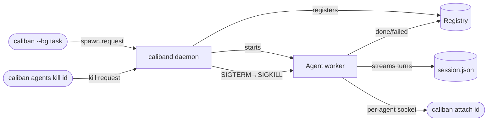

# The Background Fleet

Caliban can run sub-agents in the background — detached from your current
session — and let you monitor, attach to, or stop them at will. A per-repo
supervisor daemon (`caliband`) owns the fleet and keeps agents alive even
after the parent `caliban` process exits.

## Spawning a background agent

### From the command line

The quickest way to fire off a background task is the `--bg` flag:

```bash
caliban --bg "refactor the auth module to use the new token type"
```

This is shorthand for `caliban agents spawn --prompt <task>`. Caliban
auto-starts `caliband` if it is not already running, then returns immediately
with the new agent's id.

### From inside a session

The model can request a background sub-agent by setting `background: true`
in an `AgentTool` call. The parent session receives the id and a note to
check back via `caliban attach <id>`.

## The `caliband` daemon

`caliband` is a separate binary shipped alongside `caliban`. It runs as a
per-repo daemon, meaning each git repository gets its own daemon instance.

**Socket path** (resolution order):

1. `$CALIBAN_DAEMON_RUNTIME_DIR/<hash>.sock` if `CALIBAN_DAEMON_RUNTIME_DIR`
   is set.
2. `$XDG_RUNTIME_DIR/caliban/<hash>.sock` if `$XDG_RUNTIME_DIR` is set.
3. `$TMPDIR/caliban-daemon/<hash>.sock` (fallback; typical on macOS).

The `<hash>` is a 16-hex-char SHA-256 prefix of the absolute repo root path,
so each repo gets a stable, unique socket without naming collisions.

`caliband` auto-starts when any `caliban agents` command or `--bg` flag
needs it. You should rarely need to launch it directly.

```admonish tip title="Installing caliband"
`cargo install caliban` installs only the `caliban` binary.
To also install the daemon run:

    cargo install caliban-supervisor --bin caliband

Both binaries must be on your `$PATH` for background fleet features to work.
```

## Agent lifecycle states

| State | Meaning |
|---|---|
| `spawning` | Registered, not yet executing |
| `running` | Actively processing turns |
| `idle` | Waiting for input; no compute pending |
| `killed` | Stopped via `kill` |
| `done` | Finished successfully |
| `failed` | Finished with an error |
| `crashed` | Daemon restarted while agent was active; needs recovery |

## `caliban agents` subcommands

### `caliban agents list`

Print all registered agents and their status.

```bash
caliban agents list
```

### `caliban agents spawn`

Spawn a new background agent with an explicit prompt.

```bash
caliban agents spawn --prompt "audit all SQL queries for injection risks"
caliban agents spawn --prompt "write tests for crates/caliban-tools-builtin" --label my-test-agent
```

Options:

| Flag | Description |
|---|---|
| `--prompt <TEXT>` | Initial prompt for the agent (required) |
| `--label <NAME>` | Human-readable label shown in `list` and logs |

### `caliban agents attach <id>`

Stream a running agent's transcript live. Press `Ctrl+D` to detach without
stopping the agent.

```bash
caliban agents attach a3f8b2c1
```

### `caliban agents logs <id>`

Print the agent's session log (`session.json`).

```bash
caliban agents logs a3f8b2c1
```

### `caliban agents kill <id>`

Terminate an agent (SIGTERM, escalating to SIGKILL after a grace period).

```bash
caliban agents kill a3f8b2c1
```

### `caliban agents respawn <id>`

Kill the agent and restart it with the same original spawn spec (same
prompt, model, isolation settings).

```bash
caliban agents respawn a3f8b2c1
```

Note that `respawn` assigns a new id; the old id is removed from the
registry.

### `caliban agents rm <id>`

Remove an agent from the registry. The agent must be stopped first, unless
`--force` is passed.

```bash
caliban agents rm a3f8b2c1
caliban agents rm a3f8b2c1 --force   # remove even if still running
```

## Top-level shorthands

Four common operations have top-level sugar to save typing:

| Shorthand | Equivalent |
|---|---|
| `caliban attach <id>` | `caliban agents attach <id>` |
| `caliban logs <id>` | `caliban agents logs <id>` |
| `caliban stop <id>` | `caliban agents kill <id>` |
| `caliban kill <id>` | `caliban agents kill <id>` |
| `caliban respawn <id>` | `caliban agents respawn <id>` |
| `caliban rm <id>` | `caliban agents rm <id>` |

## `caliban daemon` subcommands

### `caliban daemon status`

Print daemon health, PID, uptime, agent count, and the socket path.

```bash
caliban daemon status
```

### `caliban daemon stop`

Ask the daemon to shut down gracefully after finishing in-flight requests.
Running agents are not automatically killed; stop them first if you want a
clean shutdown.

```bash
caliban daemon stop
```

## Session storage

Each background agent's transcript is stored as a regular caliban session
file at `<base>/agents/<id>/session.json`. This means all session tooling
(compaction, replay, audit) works on background agents out of the box.
Attaching to an agent is conceptually the same as resuming its session over
the agent's per-agent socket.

## Diagram: agent lifecycle



For how background agents use git worktree isolation, see
[Worktree Isolation](worktrees.md).
