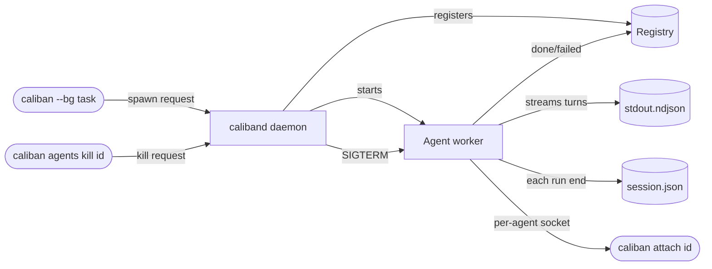

# The Background Fleet

Caliban can run sub-agents in the background — detached from your current
session — and let you monitor, attach to, or stop them at will. A
per-workspace supervisor daemon (`caliband`) owns the fleet and keeps agents
alive even after the parent `caliban` process exits.

## Spawning a background agent

### From the command line

The quickest way to fire off a background task is the `--bg` flag:

```bash
caliban --bg "refactor the auth module to use the new token type"
```

This is shorthand for `caliban agents spawn --prompt <task>`. Caliban
auto-starts `caliband` if it is not already running, then returns immediately
with the new agent's id.

### From inside a session

The model can request a background sub-agent by setting `background: true`
in an `AgentTool` call. The parent session receives the id and a note to
check back via `caliban attach <id>`.

## The `caliband` daemon

`caliband` is a separate binary shipped alongside `caliban`. It runs as a
per-*workspace* daemon: each workspace root gets its own daemon instance. A
workspace is usually a single git repository, but since v0.5.0 the supervisor
can manage a workspace spanning multiple sources (repos), each with its own
worktree isolation.

**Socket path** (resolution order):

1. `$CALIBAN_DAEMON_RUNTIME_DIR/<hash>.sock` if `CALIBAN_DAEMON_RUNTIME_DIR`
   is set.
2. `$XDG_RUNTIME_DIR/caliban/<hash>.sock` if `$XDG_RUNTIME_DIR` is set.
3. `$TMPDIR/caliban-daemon/<hash>.sock` (fallback; typical on macOS).

The `<hash>` is a 16-hex-char SHA-256 prefix of the absolute workspace root
path, so each workspace gets a stable, unique socket without naming collisions.
(For a single-repo workspace the workspace root is the repo root, so the socket
is unchanged from earlier releases.)

`caliband` auto-starts when any `caliban agents` command or `--bg` flag
needs it. You should rarely need to launch it directly.

```admonish tip title="Installing caliband"
`cargo install caliban` installs only the `caliban` binary.
To also install the daemon run:

    cargo install caliban-supervisor --bin caliband

Both binaries must be on your `$PATH` for background fleet features to work.
```

## Networked control plane (beta)

By default `caliband` serves its control plane over the local Unix domain
socket described above. Since v0.5.0 it can instead serve that same
line-delimited (NDJSON) protocol over **TCP**, so a remote client (for example
prospero) can drive the fleet across the network rather than only from the same
host. Enable it by passing `--listen <host:port>` (or setting
`CALIBAN_DAEMON_LISTEN`) when the daemon starts:

```bash
caliband --workspace-root /path/to/workspace \
  --listen 0.0.0.0:7070 \
  --tls-cert cert.pem --tls-key key.pem \
  --token "$CALIBAN_DAEMON_TOKEN"
```

```admonish warning title="TCP mode is fail-closed"
The networked control plane requires **both** a bearer token (`--token`) and
TLS (`--tls-cert`/`--tls-key`) — since v0.6.0 the daemon refuses to bind a TCP
listener that is unauthenticated or plaintext. The default Unix-socket mode is
unchanged and needs neither. The TCP transport is still **beta**.
```

Other network-mode daemon flags: `--advertise-host <HOST>` (the host clients
dial for per-agent endpoints), `--agent-port-base <PORT>` (default `7100`),
`--tls-ca <PEM>`, and `--tls-server-name <SAN>`. If the advertise host is a
wildcard such as `0.0.0.0` (for example, derived from `--listen 0.0.0.0:7070`
with no `--advertise-host`), `caliband` logs a startup warning. The endpoints it
reports would be undialable, so set `--advertise-host` to a routable name such
as the daemon's Service or pod DNS name.

## Agent lifecycle states

| State | Meaning |
|---|---|
| `spawning` | Registered, not yet executing |
| `running` | Actively processing turns |
| `idle` | Waiting for input; no compute pending |
| `killed` | Stopped via `kill` |
| `drained` | Gracefully stopped by a drain request, with its session directory kept for resume (see [Drain and resume](#drain-and-resume)) |
| `done` | Finished successfully |
| `failed` | Finished with an error |
| `crashed` | Daemon restarted while the agent was `spawning` or `running`; needs recovery |

## `caliban agents` subcommands

### `caliban agents list`

Print all registered agents and their status.

```bash
caliban agents list
```

### `caliban agents spawn`

Spawn a new background agent with an explicit prompt.

```bash
caliban agents spawn --prompt "audit all SQL queries for injection risks"
caliban agents spawn --prompt "write tests for crates/caliban-tools-builtin" --label my-test-agent
```

Options:

| Flag | Description |
|---|---|
| `--prompt <TEXT>` | Initial prompt for the agent (required, must be non-empty) |
| `--label <NAME>` | Human-readable label shown in `list` and logs |
| `--interactive` | Keep the agent running and waiting for operator messages via `agents attach`, instead of finishing after the prompt (ADR 0047) |
| `--provider <anthropic\|openai\|google>` | Provider for the new agent (defaults to caliban's default) |

### `caliban agents attach <id>`

Stream a running agent's transcript live. Text you type is sent to the agent,
which an `--interactive` agent treats as its next message. `Ctrl+D` ends input,
and `Ctrl+C` detaches without stopping the agent.

```bash
caliban agents attach a3f8b2c1
```

### `caliban agents logs <id>`

Print the agent's transcript: the append-only `stdout.ndjson` event stream in its session directory.

```bash
caliban agents logs a3f8b2c1
```

### `caliban agents kill <id>`

Terminate an agent by sending its worker `SIGTERM`. There is no automatic escalation to `SIGKILL`.

```bash
caliban agents kill a3f8b2c1
```

### `caliban agents respawn <id>`

Kill the agent and restart it with the same original spawn spec (same
prompt, model, isolation settings).

```bash
caliban agents respawn a3f8b2c1
```

Note that `respawn` assigns a new id; the old id is removed from the
registry.

### `caliban agents rm <id>`

Remove an agent from the registry. The agent must be stopped first, unless
`--force` is passed.

```bash
caliban agents rm a3f8b2c1
caliban agents rm a3f8b2c1 --force   # remove even if still running
```

## Top-level shorthands

Common operations have top-level sugar to save typing:

| Shorthand | Equivalent |
|---|---|
| `caliban attach <id>` | `caliban agents attach <id>` |
| `caliban logs <id>` | `caliban agents logs <id>` |
| `caliban stop <id>` | `caliban agents kill <id>` |
| `caliban kill <id>` | `caliban agents kill <id>` |
| `caliban respawn <id>` | `caliban agents respawn <id>` |
| `caliban rm <id>` | `caliban agents rm <id>` |

## `caliban daemon` subcommands

### `caliban daemon status`

Print daemon health, PID, uptime, agent count, and the socket path.

```bash
caliban daemon status
```

### `caliban daemon stop`

Ask the daemon to shut down gracefully after finishing in-flight requests.
Running agents are not automatically killed; stop them first if you want a
clean shutdown.

```bash
caliban daemon stop
```

## Session storage

Each background agent has a session directory holding two files:

| File | Contents |
|---|---|
| `stdout.ndjson` | Append-only stream of the agent's turn events. `caliban agents logs` prints it, and it is the transcript `attach` streams live. |
| `session.json` | A resumable snapshot of the conversation (messages + usage), rewritten atomically at the end of every run. This is what a drain leaves behind for resume. |

Attaching is a live stream over the agent's per-agent socket. It does not resume the session.

If a worker exits non-zero (for example, a provider fails on its first
request), `caliband` logs the exit status and the last 2 KB of the worker's
output to its own stdout, and marks the agent `failed`. Check the daemon's log
first when an agent dies right after spawning.

## Drain and resume

`caliband` supports a graceful **drain** for orchestrators such as
caliban-operator that need to stop agents without losing their work
([ADR 0057](../adr/0057-agent-drain-checkpoint-resume.md)):

- A `Drain` control request sends `SIGTERM` to every live agent (`spawning`,
  `running`, or `idle`), marks each `drained`, and returns each agent's id and
  session directory as a resume reference. Agents already in a terminal state
  are skipped. The request carries a grace period, but the daemon does not
  escalate to `SIGKILL` itself.
- A spawn request whose spec sets `resume_session` to such a session directory
  loads that `session.json` and continues the conversation instead of replaying
  the initial prompt. An interactive agent then waits for the next operator
  message.
- Resume replays the persisted conversation, not live process state. A tool
  call in flight at drain time is not resumed mid-execution.

```admonish note title="Protocol-level only"
Drain and resume are part of the supervisor control protocol (`SupervisorClient::drain`
and the spawn spec). There is no `caliban agents drain` or resume subcommand;
`agents spawn` always starts fresh.
```

## Diagram: agent lifecycle


```mermaid
flowchart LR
    A([caliban --bg task]) -->|spawn request| D[caliband daemon]
    D -->|registers| R[(Registry)]
    D -->|starts| W[Agent worker]
    W -->|streams turns| S[(stdout.ndjson)]
    W -->|each run end| J[(session.json)]
    W -->|per-agent socket| T([caliban attach id])
    W -->|done/failed| R
    T2([caliban agents kill id]) -->|kill request| D
    D -->|SIGTERM| W
```

For how background agents use git worktree isolation, see
[Worktree Isolation](worktrees.md).
