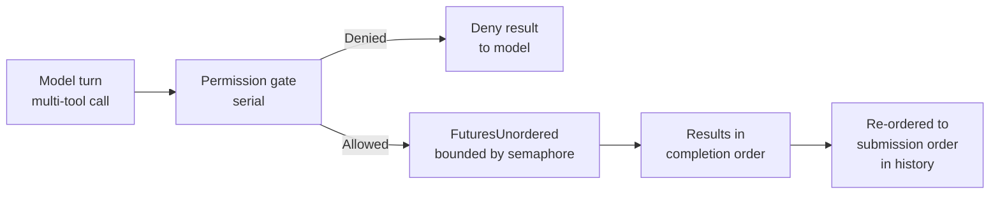

# Tool Execution

This page covers how caliban resolves file paths for tools, dispatches multiple tools concurrently within a turn, caps oversized tool output, and controls verbosity.

## Path resolution and workspace

Every filesystem and shell tool resolves paths relative to the **workspace root** — the directory caliban was started in, unless overridden.

**`--workspace <DIR>`** — Set the workspace root explicitly. Relative tool paths are joined against this directory. If not supplied, caliban uses the current working directory. Setting `--workspace` **confines the file and shell tools to that directory by default** (path restriction is implied); pass `--no-restrict-paths` to opt out. See [ADR 0048](https://github.com/caliban-ai/caliban/blob/main/docs/adr/0048-workspace-default-restricted.md).

**`--restrict-paths`** — Reject any tool call whose path resolves outside the workspace root. Absolute paths that escape the workspace return an error rather than silently accessing arbitrary filesystem locations. This is **implied when `--workspace` is set**; the explicit flag is still useful to fence to the current working directory when no `--workspace` is given.

**`--no-restrict-paths`** — Opt out of the implied restriction so the tools may read and write outside the workspace root. Conflicts with `--restrict-paths`. When combined with `--no-permissions` (auto-approve), caliban emits a startup warning that the run is unfenced.

**`additional_directories`** — A list of extra root paths declared in `settings.toml`. Tools may read and write these paths even when `--restrict-paths` is active, as long as the path falls under one of the declared roots.

```toml
# .caliban/settings.toml
additional_directories = [
  "/data/shared",
  "/home/user/docs",
]
```

```admonish note title="Path restriction vs. the OS sandbox"
`--restrict-paths` enforces containment at the Rust level before a process is spawned.
The [OS Sandbox](./sandbox.md) enforces containment at the OS level inside the subprocess.
They are independent and complementary: use both for defense-in-depth.
```

## Parallel tool dispatch

When the model emits multiple `tool_use` blocks in a single assistant turn, caliban runs them concurrently by default (ADR 0016).



**Permission hooks run serially first.** Each `before_tool` hook fires in submission order, producing an `Allowed` or `Denied` decision before any concurrent execution begins. Denied results are returned to the model immediately.

**Allowed calls fan out** into a `FuturesUnordered` pool bounded by a semaphore.

**Default concurrency limit** — `available_parallelism() − 1` (minimum 1). This leaves one CPU core for the agent loop, streaming, and the TUI render thread. Most tools are I/O-bound, so the limit is a soft ceiling against runaway fan-out rather than a strict CPU cap.

**Override flags:**

| Flag / env var | Effect |
|----------------|--------|
| `--no-parallel-tools` / `CALIBAN_NO_PARALLEL_TOOLS=1` | Run all tools serially (equivalent to a limit of 1). |
| `--parallel-tool-limit N` / `CALIBAN_PARALLEL_TOOL_LIMIT=N` | Set the concurrency limit explicitly. |

**Write conflict serialization.** Tools that write to the same target (`Edit`, `Write`, `MultiEdit`, `NotebookEdit`, `WriteMemoryTopic`) declare a conflict key. Two calls with the same key are serialized in submission order even when the concurrency limit would permit them to run together. Calls with different keys (or no key) still parallelize freely.

## Tool-result capping

Large tool results — for example, reading a multi-thousand-line file — can fill the context window quickly. Caliban caps each tool result before it is appended to the conversation.

**`tool_result_cap_chars`** (settings key, default `50000`) — Maximum character count for a single tool result delivered inline to the model. Set to `0` to disable capping.

When a result exceeds the cap, the overflow text is written to a spill file under the caliban cache directory (`~/.cache/caliban/tool-overflows/` on Linux, `~/Library/Caches/caliban/tool-overflows/` on macOS) and the model receives a truncated result with a note pointing at the spill path. The model can then decide whether to read the spill file directly.

```toml
# .caliban/settings.toml — raise the cap for large codebases
tool_result_cap_chars = 100_000
```

## Suppressing tool announcements

By default, caliban prints a line to the terminal each time it invokes a tool, showing the tool name and its primary argument. Pass **`--quiet`** to suppress these announcements. Error output from tools is never suppressed.

```bash
# Silent execution — no "Running Bash: cargo test" lines
caliban --quiet -p "run the test suite and summarise failures"
```
